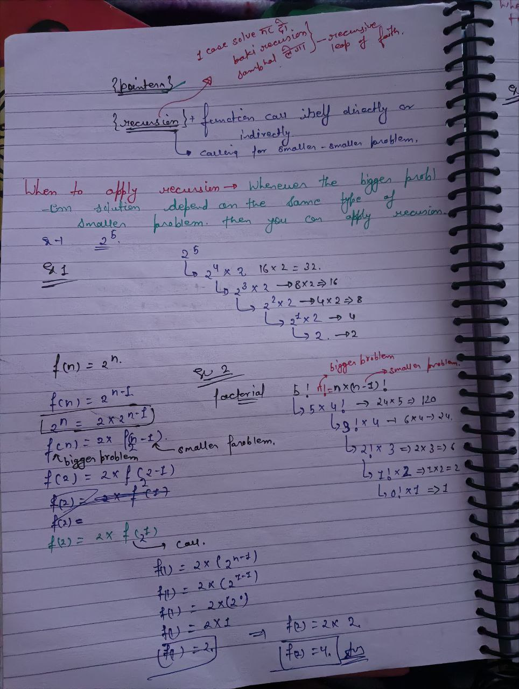
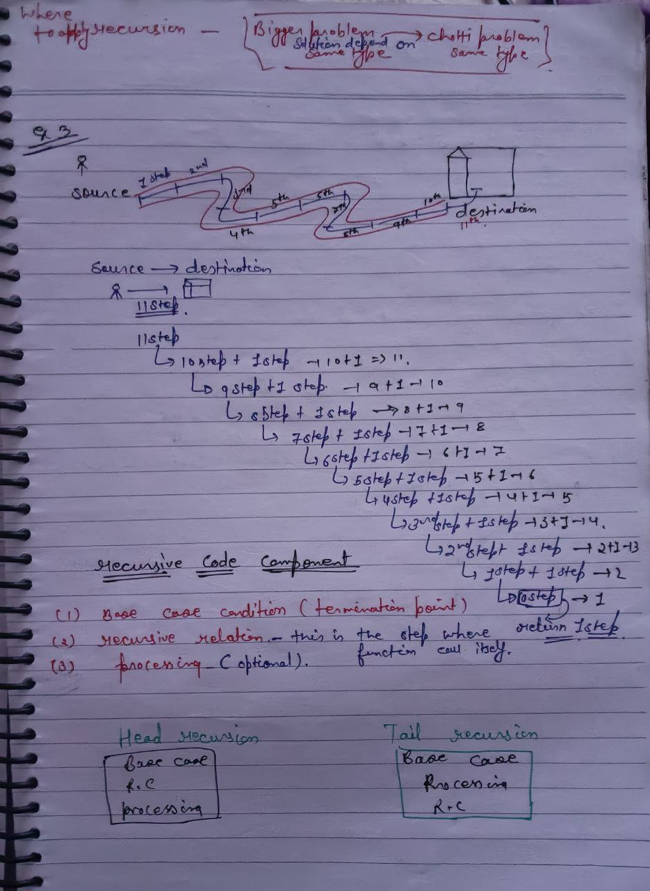

# Recursion

* Recursion means a function calling it self for the different parameter until the base case is not reached.

* two type of recrusion

  * **(1) tail recursion ->** ***business is done above the function call. (going from first to last call.)***

  * **(2) head recursion ->** ***function call first and then business logic. (business logic will done at the time of backtracking or coming back)***

* *reucursion is breaking down bigger problem into sub-problem is called recursion...*
* expecation , faith , frontend , backend, bigger problem into smaller problem..

* recursion stack ....  in recursion stack means how many recursive call are stored or there..

* so if we are not using any set map , other arry then its space is o(1) and recursion stack space is O(n)

---

